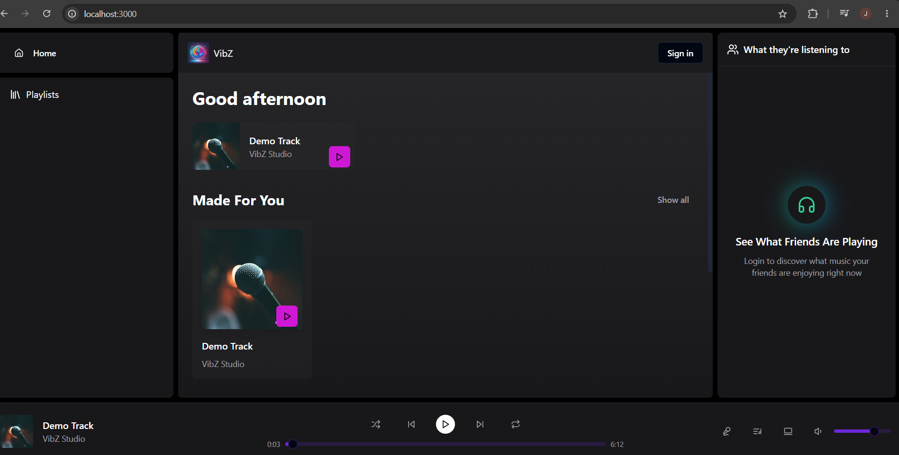
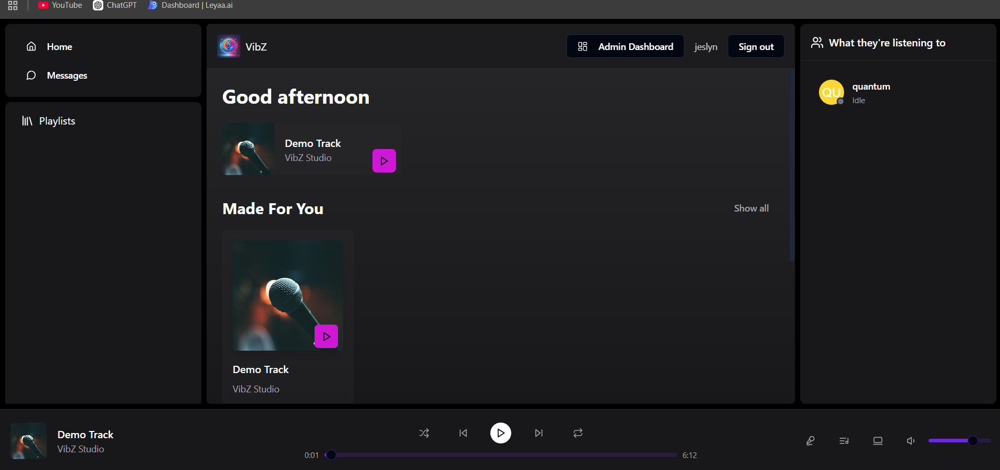
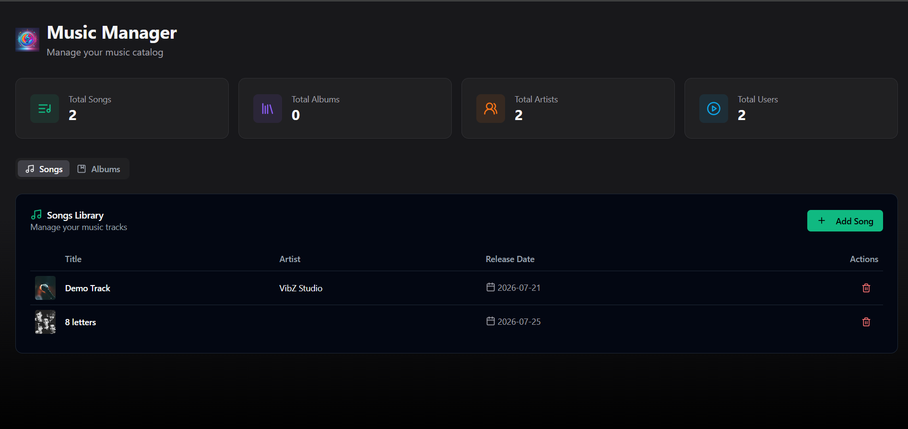
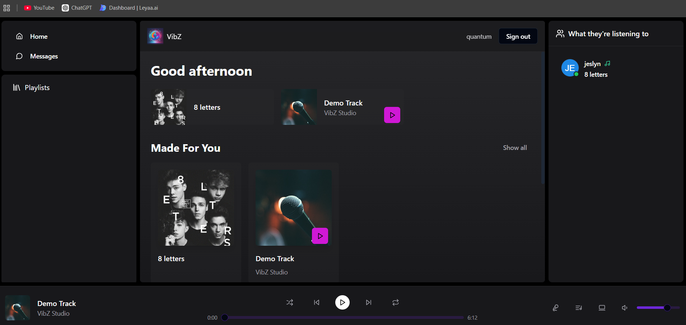
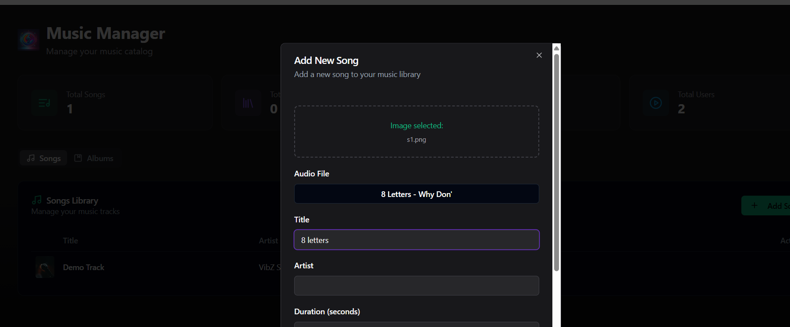
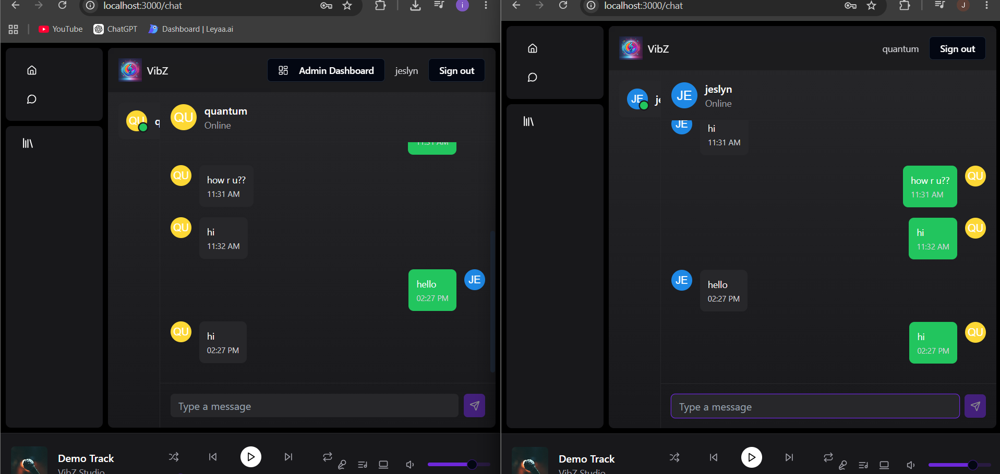
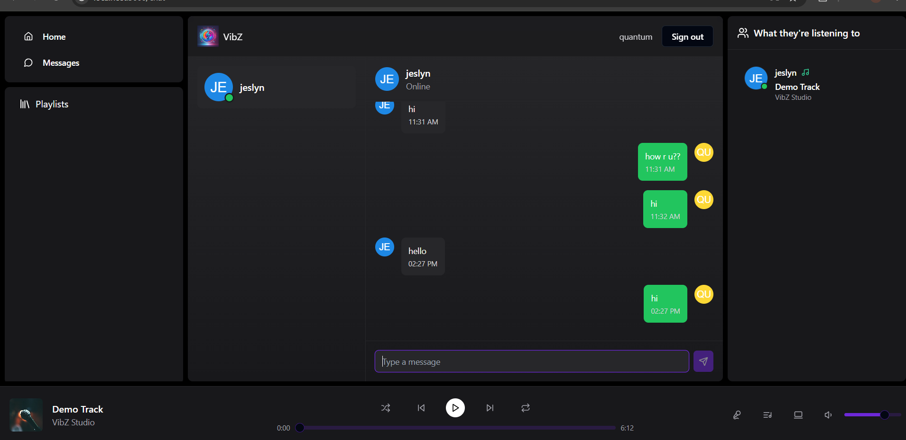

# Vibz

A full-stack music streaming web application inspired by modern music platforms. Vibz enables users to discover songs, browse albums, manage playlists, and enjoy an interactive listening experience through a responsive React frontend and a Spring Boot backend. The application provides secure authentication, real-time music playback, and an intuitive user interface powered by modern web technologies.

---

## Features

- Secure user authentication
- Browse songs and albums
- Music playback with interactive player
- Playlist management
- Friends Activity panel
- Admin Dashboard for content management
- Album and song management
- Responsive modern UI
- RESTful backend APIs
- MongoDB database integration


---

# Tech Stack

| Component | Technology |
|-----------|------------|
| Frontend | React + TypeScript |
| Backend | Spring Boot |
| Database | MongoDB |
| Authentication | Google OAuth + JWT |
| Styling | Tailwind CSS |
| UI Components | ShadCN UI + Radix UI |
| State Management | Zustand |
| Build Tool | Maven |


---


# Project Structure

```

Vibz/
│
├── backend/
│   ├── src/
│   ├── pom.xml
│   └── application.properties
│
├── frontend/
│   ├── src/
│   │
│   ├── components/
│   ├── layout/
│   ├── pages/
│   ├── stores/
│   ├── providers/
│   ├── lib/
│   ├── types/
│   └── App.tsx
│
├── README.md
└── .gitignore

```

---


# Installation

## Prerequisites

- Java 21
- Node.js 18+
- MongoDB
- Maven
- Git

---

## Clone Repository

```bash
git clone https://github.com/JeslynMathew/VibZ.git

cd project1
```

---

# Backend Setup

Navigate to backend

```bash
cd backend
```

Install dependencies

```bash
mvn clean install
```

Run Spring Boot

```bash
mvn spring-boot:run
```

Backend runs on

```
http://localhost:8080
```

---

# Frontend Setup

Navigate to frontend

```bash
cd frontend
```

Install packages

```bash
npm install
```

Start development server

```bash
npm run dev
```

Frontend runs on

```
http://localhost:3000
```

---


# Core Functionalities

### User

- Login / Register
- Browse Albums
- Browse Songs
- Play Music
- View Friends Activity
- Manage Playlists

### Admin

- Dashboard
- Add Albums
- Add Songs
- Manage Library
- Monitor Content

---


---

# Screenshots

## Home Page




---
## Admin Page



---

## Admin Dashboard




---

## Other User



---
## Adding Songs



---

## Real Time Chatting




---


# Author

**Jeslyn Mathew**

